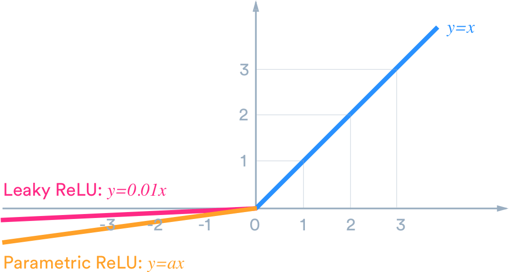
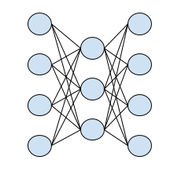

# Book

In order to learn faster I have bought the following book
- Deep Reinforcement Learning Hands-On (Maxim Lapan 2018)
I will be covering everything I am learning in this file. The book is aimed for people that already know how NN work and a strong background in Python and Mathematics.

## Chapter 1
This chapter is an introduction to concepts.
Reinforcement Learning (RL) its a Machine Learning (ML) subdivision in which we try to solve problems. It differs from Supervised Learning, where we fit an algorithm to fit some training data, and Unsupervised Learning, where we cluster the data. What is then done differently? Among an environment with high uncertainty an agent tries to maximize certain actions while getting some feedback (rewards). This is how dogs learn, how humans learn and how machines can adapt to changing environments instead of being fixed. I suggest you do your own research about the things that you can do and apply.  
It defines Reinforced Learning key ideas such as the agent, environment, actions, reward, observations etc.  
Basically our agent is going to be interacting with its environment. How does it do so? Well it can act on it (actions) and it receives feedback from the environment. It receives observations of its state, and a reward (if appropriate). The reward is a very important concept in RL, given that this is how humans learn. In the following image you can see how the agent interacts with its environment.  
  

Then we are introduced to Markov. Who is this guy and why is he famous? He is famous to have coined the term Markov Processes, which is basically an interaction between states. States are linked with other states in the form of a matrix. The value of the matrix is the probability of changing from state A to state B. The most basic example of this is the weather.  

We can have sunny and cloudy weather. If we are in a sunny state we can change to a rainy state or stay sunny. The probabilities are shown in the table below

||Sunny|Rainy|
|---|---|---|
|Sunny|0.8|0.2|
|Rainy|0.1|0.9|
  
The present state is shown in vertical (sunny rainy) and the following state is the horizontal. For example there is a 0.1 probability of changing from Rainy to Sunny weather. Of course this is not perfect, Markov Processes assumes that the current state has no implications over the past state. This is to say that we don't care what the previous states were, we only focus on the weather right now.
  
**Markov Reward Process**. To make matters more accurate we introduce the concept of reward into the mix. The reward is a feedback given when we change from one state to the other.
  
||Sports|Sleep|
|---|---|---|
|Sports|1|3|
|Sleep|4|-1|
  
The reward matrix shows the rewards if we change from one state to the next. The probabilities of actually doing so are presented in the table below.
  
||Sports|Sleep|
|---|---|---|
|Sports|0.4|0.6|
|Sleep|0.3|0.7|
  
As you can see there are 2 matrices, the transition matrix (Markov Process) and the reward matrix. There is now another new concept called **return** which is basically the sum of all future rewards. This is modelled by a variable (B). If B=0 i only take into account the present rewards. IF B=1 I have infinite visibility.
To know the value of each state we multiply the rows of both matrices (do not multiply row * column as is done in regular matrix multiplication).

**Value of state**  
Sports = 1*0.4 + 3*0.6 = 0.4+1.8 = 2.2  
Sleep = 4*0.3 + (-1)*0.7= 1.2 - 0.7 = 0.5  

As we can see, on average is more profitable to be in the state of Sports.
  
Finally, the **Markov Decision Process (MDP)** is taking everything into account. Similarly to the Markov Reward Process (MRP) we now include a third dimension which are the actions. If previously we had 2 2D matrices (transition and reward) now we add a third coordinate to both of them called "actions". What are actions? The possible actions that I can take in that state. Given a transition to one state to the next I have different probabilities for every action that I want to take. This values are randomized in order to adapt to the environment.

Well after all this theory I think you're ready for the next chapter.
  
## Chapter 2: OpenAI Gym

Open AI is a platform used developing reinforcement learning algorithms.
There are two entities:  
- Agent
- Environment
These entities can ACT on the environment, receive OBSERVATIONS and REWARDS from the environment.
When we perform an ``action`` on an environment we obtain 4 things:
- observation: How is the environment now
- reward: What is the reward for that action
- done: Is the situation done? This is because we have lost probably
- extra_information: Usually called ``_`` because we don't want to use it.
We can also ``.reset()`` the environment to start again after the simulation is done and at the beginning of each iteration.  
There are many environments for us to play around with.  

## Chapter 3: Deep Learning with PyTorch

It teaches us the ML tool that we'll be used to develop our applications.
The first important concept is a tensor. A tensor is basically a 1D, 2D, 3D array that can be used to calculate different gradients needed.
Creation of tensors:
```python
import torch
import numpy as np
a = torch.FloatTensor(3,2) # these are the dimensions of the tensors
```
For example we can also create a 3 x 2 matrix using this
```python
a = torch.FloatTensor([[1,2],[1,5],[2,9]]) #3x2 matrix
n = np.zeros(shape=(3,2))
a = torch.tensor(n) # cast to transform from np to tensor
```
Watch out for the double ``[`` when creating a 2D tensor. For every dimension we put extra ``[``. Gradients are calculated when we create a NN. Why? Because we need it in order to optimize the network and change its values. 

Gradient meaning:
>Put simply, a gradient is a vector. Its components consist of the partial derivatives of a function and it points in the direction of the greatest rate of increase of the function

Gradient descent meaning:
> Gradient descent is an optimization algorithm used to minimize some function by iteratively moving in the direction of steepest descent as defined by the negative of the gradient. In machine learning, we use gradient descent to update the parameters of our model.

Now we can create a NN. What do we use? Tensors and activation funtions. The most common activation function is ``ReLU``. Google definition:
> ReLU stands for rectified linear unit, and is a type of activation function. Mathematically, it is defined as y = max(0, x). Visually, it looks like the following: ReLU is the most commonly used activation function in neural networks, especially in CNNs



Basically Relu is the function y=x but negative values are not taken into account. The following code explains how ReLU works:

```python
def relu(x):
    y = x
    if x<0:
        y = 0
    return y
```

Building a NN. We can use the ``nn`` class in torch to build the NN. You can see the process in the following code. We use two building blocks:
- nn.Linear to display the two layers (input and output)
- nn.ReLU to set the activation function
```python
import torch
model = torch.nn.Sequential(
    torch.nn.Linear(4, 3),
    torch.nn.ReLU(),
    torch.nn.Linear(3, 4),
)
```

The above code will generate a NN with this layout:


|Layer|Number of Neurons|
|---|:---:|
|Input|1|
|Hidden|4|
|Output|4|  


### Loss funtions
Calculate how well the Network is doing. This is done by having an output that we can compare it with. Why is this model bad? 
### Optimizers
Given the loss and the current layer, how can I improve it? Common optimizers below.
- ADAM 
- SGD

### Monitoring the progress of the training
This is specially usegul because we need to know how the model is doing right now. The book recommends TensorBoard (which depends on tensorflow.)
> This is the MatplotLib of ML ~ Nestor 2020

I tried learning tensorboard but it doesn't work with pip. You need to install Conda on Windows which is a pain. Also this book is incredibly outdated, and it's just 2 years old. Pretty crazy.

## Chapter 4: Cross Entropy
I found this chapter to be the first really practical one. This chapter allowed my to implement my first algorithm of Reinforcement Learning.

Basically it's using a regular NN for classification. 
> What's the classification?

You may ask. Well let's bring our attention to the cartpole example. In the cartpole example we have 4 inputs (observations) and 2 outputs (actions). This is what we want the NN to do. We give the NN the observations and it gets us an action. Problem is:  
How do we train the network? There surely must be a way. We run batches of simulations and then filter out the best 30%. We train the network with those values. Then we run a bunch of simulations and do the same process. The agent has some randomness so we will get good performance out of some of them!!

In steps:
- Run 16 simulations
- Choose best 5 of those simulations
- Train the process with those 5
- Repeat

Pretty easy right? Those best 30% are joined together as a whole input that will be used to training the network. We don't have VALIDATION and TESTING samples.

I commented every single line of ``Chapter04/nestor01.py`` so that you understand the process. I should include pictures of the setup.
Here's the code 


<details>
  <summary>
    Chapter04/nestor01.py
  </summary>

```python
#!/usr/bin/env python3
import gym # environment of gym
from collections import namedtuple # to create a specific struct
import numpy as np # numpy duh
from tensorboardX import SummaryWriter # to write the result in some sick as graphs

# our core for machine learning
import torch
import torch.nn as nn # neural network
import torch.optim as optim # optimization (backpropagation?)


HIDDEN_SIZE = 128 # the number of hidden neurons
BATCH_SIZE = 16
PERCENTILE = 70 # only the best 30% remeains after each batch

# Basically a struct the first is the name of the struct (which in this case is,
# duh, the same name of the variable) Then we got the field names. There are
# only two things, in the first one "reward" and "steps" episode.reward and
# episode.steps is possible in this situation We can also do episode[0] to refer
# to reward and likewise episode[1] to refer to "steps" the second one is the
# episode step with observation and action inside
Episode = namedtuple('Episode', field_names=['reward', 'steps'])
EpisodeStep = namedtuple('EpisodeStep', field_names=['observation', 'action'])

class Net(nn.Module): # we specify the parent class so that we can use super later
    def __init__(self, obs_size, hidden_size, n_actions):
        """ Constructor. We are just creating a NN, that's it!"""
        super(Net, self).__init__() # inicializar herencia
        self.net = nn.Sequential(
            nn.Linear(obs_size, hidden_size), # 1st and 2nd layer
            nn.ReLU(), # activation funtion. Always use relu (sigmoid is also common)
            nn.Linear(hidden_size, n_actions) # 2nd and 3rd layer
            # note that there is no softmax, we would use a special function for
            # that
        )

    def forward(self, x):
        """ Returns the value of the network """
        return self.net(x) # with the currents weights return the output
        # x -> y. Just like a regular funtion, we introduce 4 observation values
        # and return 2 actions We will then have to decide that the highest of
        # those two actions will be the actual output that is still to be
        # implemented, with the training I guess


def iterate_batches(env, net, batch_size):
    """ We are just going to go through the batches and see what happens hahha
    """
    # declaring the varibles needed
    batch = [] # rn the batch is empty
    episode_reward = 0.0 # note that by putting the .0 we make sure that the value is float
    episode_steps = [] # why is this an array? maybe we want to change every step and its info?
    obs = env.reset() # of course we need to reset the environment passed to us at the beginning
    sm = nn.Softmax(dim=1) # This is used to get probabilities out of the raw input.

    while True:
        obs_v = torch.FloatTensor([obs]) 
        # We transform the initial observations gathered into a tensor (this
        # will be used to feed the NN). Not that this is a single element 1x4
        # (two dimensions)
        act_probs_v = sm(net(obs_v)) 
        # we are only feeding the observation tensor into the net and using sm
        # to unpack it given that it is not destributed probability, and we want
        # a probability
        act_probs = act_probs_v.data.numpy()[0] 
        # we need to unpack all this data and transform it into an array. What
        # happens is that the output is 1x2 so the [0] will access to both
        # actions probabilities
        action = np.random.choice(len(act_probs), p=act_probs) 
        # now choose one of those based on the probabilities that I have passed
        # to you. You're gonna have to choose between 0 and 1. The probs of 0
        # and 1 are determined by act_probs. 0 and 1 are the two choices for
        # actions. In this example it's just left and right. This is interesting
        # cuz I could use this probabilities in my robot game by choosing
        # between two actions: call lie or believe it. Pretty interesting stuff!
        new_obs, reward, is_done, _ = env.step(action) 
        # perfect so now I used the random action based on those probabilities
        # and act on the environment. I will get the reward, next observation
        # and is_done
        episode_reward += reward 
        # Total amount of reward. Isn't this reseted to 0 when we lose? Probs
        # later.
        episode_steps.append(EpisodeStep(observation=obs, action=action)) 
        # save this results for further examination. Note that we are not saving
        # the action that we got. We observe and we act. That's what we save,
        # that's the "thought" process of the agent we are going to repeat this
        # process and saving steps until is_done = True
        if is_done:
            # save the results into a batch with the episode and the total
            # reward the reward is, i am guessing the metric used to discern
            # good and bad episodes
            batch.append(Episode(reward=episode_reward, steps=episode_steps))
            episode_reward = 0.0 # reset the reward
            episode_steps = [] # reset episodes
            new_obs = env.reset() # reset env and get new observation
            if len(batch) == BATCH_SIZE: # have we gone through all the episodes that we wanted to?
                yield batch 
                # damn. It can be used to pick up were it left off. It's a
                # return but leaves the funtion intact so that we can create
                # more batches without declaring everything again. I find this
                # amazing, what a reserved word
                batch = [] 
                # when we pickup again we have an empty batch all of a sudden
        obs = new_obs # crucial. We assign the last observation to the new one


def filter_batch(batch, percentile):
    rewards = list(map(lambda s: s.reward, batch)) # wtf did it do. This is my first impression
    reward_bound = np.percentile(rewards, percentile) 
    # returns the percentile 70, upper 30%. This is just a number, for example
    # 35.5 is the 70 percentile reward. We can use this to delete everything
    # lower later
    reward_mean = float(np.mean(rewards)) 
    # calculate the mean (average of all the rewards, just to show it)

    train_obs = []
    train_act = []

    for example in batch:
        if example.reward < reward_bound:
            continue 
        # just skips this item in the for loop! Super useful. Bonus: pass is
        # used to don't do anything inside a funtion, for example if we want it
        # empty

        # extend is used to append another list, like list += new_list. Gotta be
        # careful with strings, which are considered arrays of chars.
        train_obs.extend(map(lambda step: step.observation, example.steps))
        train_act.extend(map(lambda step: step.action, example.steps))
        # i am going to have a massive 1 sample out of those 16 episodes that
        # consists in 5 of those episodes, all their steps (30+30+30+30+30)
        # observations and actions. What led them there? Why are those good?
    train_obs_v = torch.FloatTensor(train_obs) # we want the train observations
    train_act_v = torch.LongTensor(train_act) # Why is this tensor long? Why doesn't it have brackets?

    return train_obs_v, train_act_v, reward_bound, reward_mean


if __name__ == "__main__":

    # create env and get n_actions and n_observations
    env = gym.make("CartPole-v0")
    # env = gym.wrappers.Monitor(env, directory="mon", force=True)
    n_actions = env.action_space.n
    n_observations = env.observation_space.shape[0]

    net = Net(n_observations, HIDDEN_SIZE, n_actions)
    objective = nn.CrossEntropyLoss() 
    # this is what we want to achieve. Cross entropy method whatever that means,
    # don't fully understand it get.
    optimizer = optim.Adam(params=net.parameters(), lr=0.01) 
    # note that we can access the parent function .parameters. The learning rate
    # is set to 0.01. Not much thought given to learning rate. A higher learning
    # rate makes the algorithm be more aggressive but also more volatile. A
    # smaller learning rate will take longer but won't be as volatile. We wanna
    # find a sweet spot. Here! the optimizer can actually change the parameters
    # of the net, which is basically what's doing here
    writer = SummaryWriter()
    writer = SummaryWriter(comment="-cartpole")


    for iter_no, batch in enumerate(iterate_batches(env, net, BATCH_SIZE)):
        # YOU CAN ITERATE A FUNCTION WHAT!. Iterate batches returns yields
        # several batches of 16 this is just the first iteration (0). This is
        # basically like a while because we can call the function over and over
        # until our conditions are met. Pretty impressive.

        obs_v, acts_v, reward_b, reward_m = filter_batch(batch, PERCENTILE) 
        # creates obs_v and acts_v based on the batches
        optimizer.zero_grad()
        action_scores_v = net(obs_v)
        loss_v = objective(action_scores_v, acts_v) # what we actually got vs the target
        loss_v.backward() # backpropagation
        optimizer.step() # update the nn

        # show progress in the screen
        print("%d: loss=%.3f, reward_mean=%.1f, reward_bound=%.1f" %(iter_no, loss_v.item(), reward_m, reward_b))
        writer.add_scalar("loss", loss_v.item(), iter_no)
        writer.add_scalar("reward_bound", reward_b, iter_no)
        writer.add_scalar("reward_mean", reward_m, iter_no)
        if reward_m > 199:
            print("Solved!")
            break
    writer.close()
```


</details>

## Chapter 5: Bellman's equation

This equations aims to provide us with 


